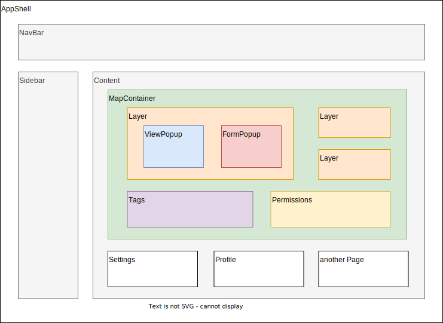

# Utopia UI      

**UI Framework for Real-Life-Networking-Apps**

*Real change happens in real life when we meet in person and connect as local communities manifesting their ideas with the earth. When we help each other to step out of our bubbles at home and start building common infrastructure to meet human needs in harmony with Mother Earth.*

*That is why Utopia UI exists. It is a UI kit for minimalist, fast, intuitive and mobile-first map apps, as a tool for local connection and decentralised networking. We believe in maps as the perfect link between digital tools and real life action* 

*It can work with any backend or p2p database and any kind of data structure.*

## Mission 
Utopia UIs mission is to provide open source building blocks to create beautiful applications with a focus on real life impact, local communities and gamification. 

The building blocks are designed to allow different networks and communities to assemble their map and app for their specific needs and purpose.

It is the base of [Utopia Map](https://github.com/utopia-os/utopia-map) and [Utopia Game](https://github.com/utopia-os/utopia-game).

## Features

* Interactive Component Map with customizable Layers (like Projects, Event, People)
* Flexible API-Interface to make it work with every backend or p2p database
* Create, Update, Delete Items
* User authentification API-Interface
* Customizable Profiles for users and other items
* App shell with navigation bar and sidebar
* HTML-aware text previews that preserve mentions when content is shortened

## Getting Started

1. If you want to use **Utopia UI** in your project, check out [`/examples`](/examples) to see how to use its components.

2. If you need more information you can explore [the docs](https://utopia-os.org/utopia-ui/)

3. If you like to contribute to our library, see the [Contribution Guide](/CONTRIBUTING.md) to see how to setup a development environment on your local machine.

## Components

## Map Component
The map shows various Layers (like places, events, profiles ...) of Items at their respective position whith nice and informative Popup and Profiles.

Tags, colors and clusters help to retain the overview.

### Map Options

 Option         | Type              | Default      | Required   | Description 
 ---            | ---               | ---          | ---        | ---    
 `height`       | `string`          |`'400px'`     |    No      | height of the map           
 `width`        | `string`          |`'100vw'`     |    No      | width of the map
 `center`       | `LatLng`          |`[50.6, 9.5]` |    No      | initial map position           
 `zoom`         | `number`          |`10`          |    No      | initial zoom level

### Layer Options

 Option         | Type              | Default      | Required   | Description 
 ---            | ---               | ---          | ---        | ---    
|      ...      |                   |              |            |

## Join the community

*This Library is in alpha stage. You are very welcome to participate in the development*

*We are looking for Web Developer, UX Designer, Community Manager, Visionaries, Artists, etc. who like to support this Vision.*

[https://t.me/UtopiaMap](https://t.me/UtopiaMap)

## Support us

---

This project is tested with BrowserStack
